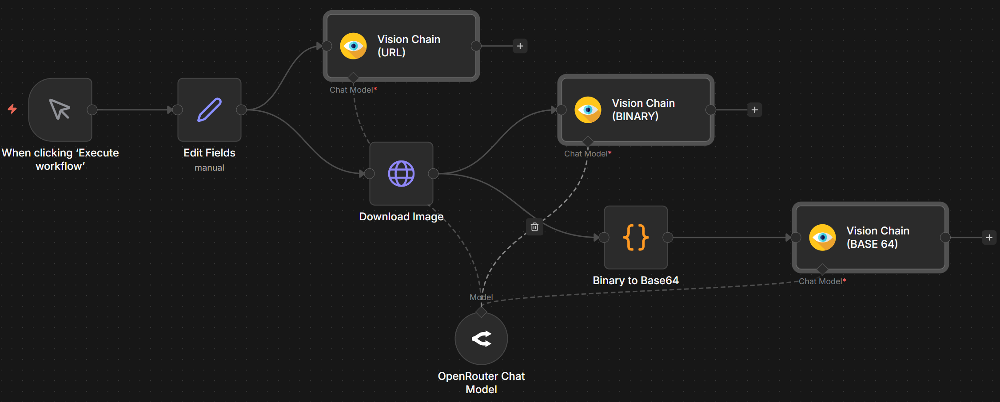

# n8n-nodes-universal-llm-vision

**Add vision capabilities to your n8n workflows** - Analyze images with AI using any LLM provider, with flexible integration options for every use case.

## Installation

Install via n8n's community node interface:

1. Open n8n in your browser
2. Go to **Settings > Community Nodes**
3. Search for `n8n-nodes-universal-llm-vision` and click Install

Both nodes will be available in your node palette under the **"AI"** category.

## Choose Your Approach

This package provides **two nodes** with different integration approaches:

### 🎯 Universal LLM Vision

**Custom credentials node** - Connect to any OpenAI-compatible vision API with your own credentials.

- ✅ **Any custom provider**: Configure your own API endpoints and credentials
- ✅ **Vision model discovery**: Auto-fetch vision-capable models from [models.dev](https://models.dev) with pricing
- ✅ **Full API control**: Custom headers, parameters, JSON response format
- ✅ **Rich metadata**: Token usage, costs, and model info in output
- ✅ **AI Agent ready**: Use as a tool in AI Agent workflows

**Best for:** Production workflows, custom APIs, full parameter control


### 🔗 Vision Chain

**Langchain integration node** - Reuse your existing n8n chat model connections (OpenAI, Anthropic, OpenRouter, etc.).

- ✅ **Reuse chat models**: Connect any n8n chat model node you already have configured
- ✅ **Simpler setup**: No need to duplicate credentials
- ✅ **Quick switching**: Change models by swapping the connected chat model node

> ⚠️ **Note**: Vision Chain cannot be used as a tool in AI Agents. For AI Agent tool integration, use Universal LLM Vision instead.



### Important Note

**Both nodes only work with vision-capable models.** Regular text-only models are not supported. Most modern multimodal models from OpenAI (GPT-4o), Anthropic (Claude Sonnet), Google (Gemini), and OpenRouter support vision.

**Common features:**
- Binary data, URL, and base64 image sources
- Customizable prompts with intelligent defaults
- Auto/Low/High detail control for cost optimization
- Production-ready with 241 tests

📖 **[Read the detailed comparison in the Vision Chain documentation](docs/VISION_CHAIN.md)**

## Quick Start

### Vision Chain (Fastest Setup)

Perfect for getting started with LLM Vision:

1. Add any **Chat Model** node (e.g., OpenAI Chat Model)
2. Add **Vision Chain** node
3. Connect: `Chat Model` → `Vision Chain` (Chat Model input)
4. Configure image source and prompt
5. Done! ✨

```
[Your Data] → [Vision Chain] → [Next Node]
                    ↑
              [Chat Model]
```

📖 **[Complete workflow example](example-workflow-chain.json)**

### Universal LLM Vision (Full Control)

For production workflows with specific requirements:

1. Add **Universal LLM Vision** node
2. Configure credentials (provider + API key)
3. Select from available vision models
4. Configure image source and prompt
5. Customize parameters, headers, system prompt as needed
6. Done! ✨

```
[Your Data] → [Universal LLM Vision] → [Next Node]
```

📖 **[Complete workflow example](example-workflow.json)**

## Use Cases

**Universal LLM Vision** - Best for:
- 🏭 **Production pipelines**: Batch image processing with metadata tracking
- 📊 **Custom APIs**: Integration with proprietary vision models
- 🔍 **Structured extraction**: OCR with JSON mode for invoices, receipts, forms
- 🎯 **Full control workflows**: Custom headers, parameters, response formats

**Vision Chain** - Best for:
- 🤖 **AI Agents**: Customer support bots, visual Q&A assistants
- ⚡ **Rapid prototyping**: Quick model testing and switching
- 🔄 **Dynamic workflows**: Model selection based on conditions
- 🔗 **Multi-step analysis**: Chaining different models for specialized tasks

**Both nodes** - Common uses:
- Product catalog descriptions and quality inspection
- Document processing (text extraction, handwriting recognition)
- Specialized analysis (medical, architectural, fashion)
- Scene understanding and object detection

## Detailed Configuration

### Universal LLM Vision Node

#### Providers & Models

**Supported Providers:**
- OpenAI (GPT-4o, GPT-4 Turbo with Vision)
- Google Gemini (Flash, Pro Vision)
- Anthropic (Claude Sonnet, Opus with Vision)
- OpenRouter (vision models from multiple providers)
- Groq (Llama Vision, Mixtral Vision)
- Grok/X.AI (Grok Vision)
- Custom (any OpenAI-compatible vision API)

**Model Selection:**
The node auto-fetches all vision-capable models from [models.dev](https://models.dev), displaying:
- Model name
- Pricing (input/output per 1M tokens)
- Model ID in parentheses (e.g., `$2.5 / $10 per 1M tokens (gpt-4o)`)

**Tested Models:**
- OpenAI: GPT 5, GPT 4.1, GPT 4o
- Google: Gemini 2.5 Flash Lite, Gemini 3.0 Flash
- OpenRouter: Gemma 3 27B, GLM 4.6V, Ministral 3, Nemotron VL, Qwen3 VL
- Grok/X.AI: Grok 4.1 Fast

#### Credentials

1. Select your provider
2. Enter API key
3. (Optional) Custom base URL for custom providers

For **custom OpenAI-compatible APIs**:
- Select "Custom Provider"
- Provide Base URL (e.g., `https://your-api.com/v1` or `http://localhost:11434/v1` for Ollama)
- **API Key is optional** for local providers like Ollama - leave empty if not needed
- The node will attempt to auto-fetch available models
- Use **Manual Model ID** if auto-fetch fails

#### Parameters

**Required:**
- **Model**: Select from dropdown or enter manually
- **Image Source**: Binary Data / URL / Base64
- **Prompt**: Your analysis instruction

**Optional (Model Parameters):**
- Temperature (0-2): Creativity level
- Max Tokens: Response length limit
- Top P: Nucleus sampling parameter

**Advanced Options:**
- System Prompt: Guide model behavior (intelligent default provided)
- Response Format: Text or JSON
- Custom Headers: Add custom HTTP headers
- Additional Parameters: Provider-specific parameters
- Manual Model ID: Override model selection
- Output Property Name: Where to store result (default: `analysis`)
- Include Metadata: Add usage stats and token counts

### Vision Chain Node

#### Setup

1. **Add Chat Model**: Any n8n chat model (OpenAI, Anthropic, etc.)
2. **Connect to Vision Chain**: Use the "Chat Model" input
3. **Configure Image Source**: Binary / URL / Base64
4. **Write Prompt**: Your analysis instruction

#### Parameters

**Required:**
- **Image Source**: Binary Data / URL / Base64
- **Prompt**: Analysis instruction

**Options:**
- **Image Detail**: Auto / Low / High (affects cost and quality)
- **System Prompt**: Comprehensive default for image understanding (customizable)
- **Output Property Name**: Configure result property (default: `analysis`)

**Note:** Temperature, max tokens, and model selection are configured at the chat model node level.

## Examples & Workflows

### 📥 Example Files

- **[example-workflow.json](example-workflow.json)** - Complete Universal LLM Vision workflow
- **[example-workflow-chain.json](example-workflow-chain.json)** - Vision Chain with AI Agent

### Universal LLM Vision Examples

#### Image Analysis from URL
```
Webhook → Set (image URL) → Universal LLM Vision → Respond
```
Perfect for: Product catalog automation, web scraping with analysis

#### Batch Image Processing
```
Read Binary Files → Universal LLM Vision → IF → Split → [Process Results]
```
Perfect for: Quality control, document classification, content moderation

#### OCR with Structured Output
```
HTTP Request (get image) → Universal LLM Vision (JSON mode) → Set → Database
```
Configure:
- Response Format: JSON
- Prompt: "Extract text with structure: {title, date, amount, items: []}"

### Vision Chain Examples

#### Image Analysis with Chat Models
```
[Data] → Vision Chain → [Process Results]
             ↑
        [Chat Model]
```
Perfect for: Image classification, visual Q&A, content moderation

#### Dynamic Model Switching
```
[Data] → Vision Chain → [Output]
             ↑
        [Different Chat Models based on conditions]
```
Perfect for: Cost optimization, fallback strategies, A/B testing

#### Image Analysis Pipeline
```
Download File → Vision Chain (describe) → Vision Chain (extract text) → Process
                     ↑                         ↑
                [Model A]                  [Model B]
```
Perfect for: Multi-step analysis, combining different model strengths

## Development & Contributing

This package is built using the [n8n-community-node-starter](https://github.com/alejandrosnz/n8n-community-node-starter) boilerplate, providing:

- Robust programmatic node architecture
- Comprehensive testing framework (Jest)
- CI/CD pipelines
- AI-assisted development tools

Contributions are welcome! Feel free to:
- 🐛 **Report bugs** by opening an issue
- 💡 **Suggest features** or improvements
- 🔧 **Submit pull requests** with fixes or enhancements

## License

MIT License - see [LICENSE](LICENSE) file for details.

## Links

- [n8n Documentation](https://docs.n8n.io/)
- [Community Nodes Guide](https://docs.n8n.io/integrations/community-nodes/)
- [n8n-community-node-starter](https://github.com/alejandrosnz/n8n-community-node-starter) - The boilerplate this node is based on