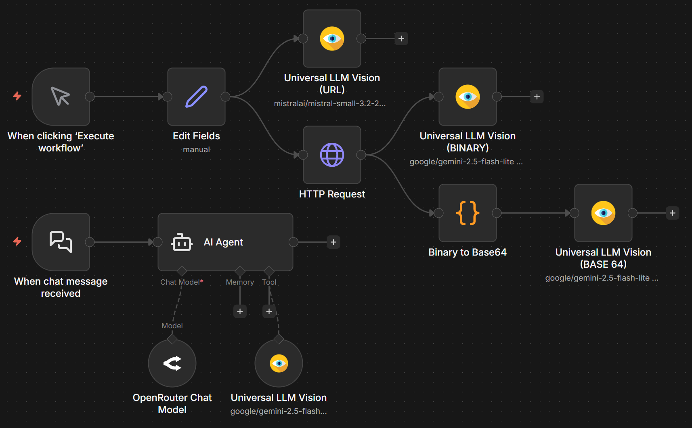
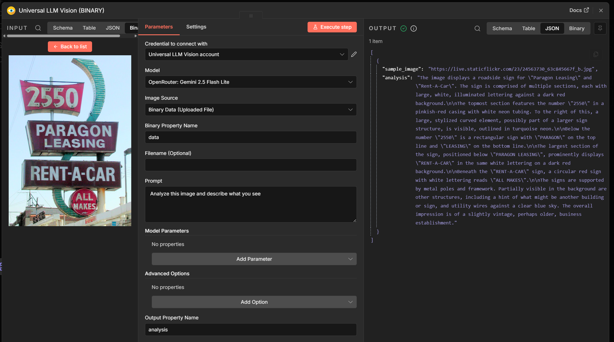

# n8n-nodes-universal-llm-vision

A comprehensive n8n community node for analyzing images using multiple LLM vision providers (OpenRouter, Groq, Grok, OpenAI, Anthropic, Google Gemini).

## Installation

Install via n8n's community node interface:

1. Open n8n in your browser
2. Go to Settings > Community Nodes
3. Search for "n8n-nodes-universal-llm-vision" and install

## Features

- ✅ Image analysis using multiple LLM providers
- ✅ Support for binary data, URLs, and base64 images
- ✅ Flexible prompts and model parameters
- ✅ Metadata inclusion (usage, tokens)
- ✅ Custom headers and advanced parameters
- ✅ Comprehensive testing included
- ✅ n8n Agents compatible
- ✅ **Auto-discovery of all vision-capable models from the market** (powered by [models.dev](https://models.dev))

## Usage

### Basic Setup

1. Add the "Universal LLM Vision" node to your n8n workflow
2. Configure your API credentials for the chosen provider
3. Select image source and analysis parameters

### Supported Providers

- OpenAI
- Google Gemini
- Anthropic
- OpenRouter
- Groq
- Grok (X.AI)
- Custom (OpenAI-compatible API)

### Supported Models

The node automatically fetches and displays **all vision-capable models** from the market using the [models.dev](https://models.dev) API. Each model listing shows pricing and the exact model ID in parentheses (e.g., `$2.5 / $10 per 1M tokens (gpt-4o)`).

The following models have been tested and verified to work:

- **OpenAI**: GPT 5, GPT 4.1, GPT 4o, ...
- **Google**: Gemini 2.5 Flash Lite, Gemini 3.0 Flash, ...
- **OpenRouter**: Gemma 3 27B, GLM 4.6V, Ministral 3, Nemotron VL, Qwen3 VL, ...
- **Grok/X.AI**: Grok 4.1 Fast

### Available Operations

- **Analyze Image**: Analyze images with custom prompts

### Configuration

#### Credentials

Set up your API credentials:

- **Provider**: Select LLM provider (OpenAI, Anthropic, etc.)
- **API Key**: Your provider's API key
- **Base URL**: Custom API endpoint (optional, defaults provided)

To use a custom OpenAI-compatible API:
- Select "Custom Provider"
- Provide your API Key and Base URL (e.g., `https://your-api.com/v1`)
- Use **Manual Model ID** in Advanced Options to specify the model

#### Node Parameters

- **Model**: Auto-populated dropdown with all vision-capable models from the market. Displays pricing and model ID in parentheses (e.g., `"$2.5 / $10 per 1M tokens (gpt-4o)"`). The model ID is what gets sent to the API.
- **Image Source**: Binary Data, URL, or Base64
- **Prompt**: Analysis prompt
- **Image Detail**: Auto/Low/High resolution
- **Model Parameters**: Temperature, Max Tokens, Top P
- **Advanced Options**: System prompt, response format, custom headers, additional parameters
- **Manual Model ID**: Specify a model ID manually (required for custom providers)
- **Output**: Property name and metadata inclusion

#### Custom Provider

When using a custom OpenAI-compatible API, you **must** provide the model ID in the **Manual Model ID** field (in Advanced Options). The automatic dropdown won't work for custom providers.

1. Select "Custom Provider"
2. Go to Advanced Options
3. Fill in **Manual Model ID** with your provider's model identifier
4. The node will use this ID for all requests

## Examples

See the [example workflow](example-workflow.json) for a complete setup.

### Analyze Image from Binary Data

1. Use a "Download" node to fetch an image
2. Connect to "Universal LLM Vision" node
3. Set Image Source to "Binary Data"
4. Configure prompt: "Describe this image in detail"

### Analyze Image from URL

1. Add "Universal LLM Vision" node
2. Set Image Source to "URL"
3. Provide image URL
4. Use prompt: "Extract all text from this image (OCR)"

## Development

This node was built using the [n8n-community-node-starter](https://github.com/alejandrosnz/n8n-community-node-starter) boilerplate, which provides:

- Programmatic node architecture for complex logic
- Built-in CI/CD pipelines
- Comprehensive testing framework
- AI-assisted development support

### Contributing

1. Fork the repository
2. Create a feature branch
3. Make your changes with tests
4. Submit a pull request

## License

MIT License - see LICENSE file.

## Links

- [n8n Documentation](https://docs.n8n.io/)
- [Community Nodes Guide](https://docs.n8n.io/integrations/community-nodes/)
- [n8n-community-node-starter](https://github.com/alejandrosnz/n8n-community-node-starter) - The boilerplate this node is based on